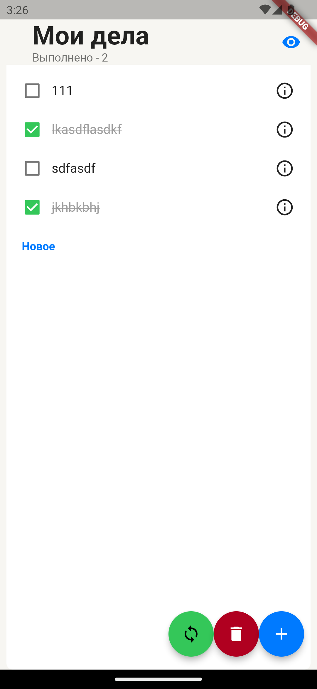

# todo_app

Flutter app to manage your todos.

# README

For review use this merge requsts. But, README is up to date in master branch
v2 - https://github.com/Demezy/todo_app/pull/5
v1 - https://github.com/Demezy/todo_app/pull/1

## Stack

- riverpod
- flutter_hooks
- freezed
- Isar

## Features V2
- Isar db for persistent data
- Riverpod for state management (since v1)
- clean architecture (since v1)
- lint rules
- reactive updates (just open Isar inspector and ensure)
- async/await only, no .then

## Features V1
- add tasks
- hide done tasks
- swipes
  - animation
  - open menu via short swipe
  - perform action via long swipe
- clean architecture!
- app icon

## V2 Gallery
Changes mostly inder the hood

## V1 Gallery 

## Download links
[V2 app](https://github.com/Demezy/todo_app/releases/download/release_v2/app-release.apk)
[V1 app](https://github.com/Demezy/todo_app/releases/download/untagged-3ce9b9b2c5f4b54647ff/app-release.apk)

